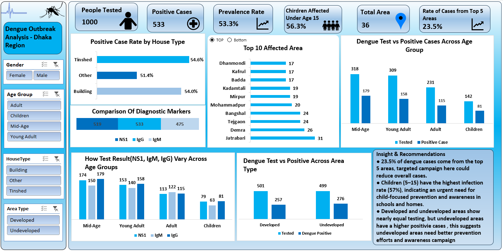

# 🦟 Dengue Outbreak Analysis Dashboard (Dhaka Region)

This project is an **Excel-based Analytical Dashboard** that tracks dengue outbreak patterns in the **Dhaka region**.  
It was developed using **Power Query, Pivot Tables, PowerPivot (Data Model), and Excel Charts** to provide insights into infection rates, diagnostic test results, and demographic patterns of affected individuals.

---

## 🚀 Features
- **Data Preparation & Modeling**
  - Processed raw health survey data using **Power Query**.
  - Built calculated measures and relationships in **PowerPivot**.

- **Interactive Dashboard**
  - Filters by **Gender, Age Group, House Type, and Area Type**.
  - Analysis of testing results across demographics and regions.

- **Visual Insights**
  ## 📸 Dashboard Preview

---

## 🔧 How to Use
1. Download the repository.  
2. Open **Dengue_Dashboard.xlsx** in Excel (Office 2016+ recommended).  
3. Use the filters (Gender, Age Group, House Type, Area Type) to explore results interactively.    

---

## 📌 Key Insights
- **53.3% prevalence rate** detected among tested individuals.  
- **Children (under 15)** had the **highest infection rate (56.3%)**, requiring targeted prevention campaigns.  
- **Top 5 areas** contributed **23.5% of total cases** – meaning localized interventions here could significantly reduce the outbreak.  
- **House types** such as **tinshed and buildings** show nearly equal infection rates (~54%), suggesting environment-driven spread.  
- Both **developed and undeveloped areas** had similar testing numbers, but undeveloped areas showed **higher positive rates**.  

---

## 💡 Recommendations
- Focus prevention campaigns in **high-risk areas** (e.g., Jatrabari, Demra, Bangshal).  
- Launch **child-focused awareness programs** in schools, as children are the most affected group.  
- Improve **sanitation and mosquito control** in undeveloped areas.  
- Encourage **early testing and diagnostics** (NS1, IgM, IgG) to reduce severe cases through timely detection.  

---

## 🛠️ Tools & Technologies
- **Excel Power Query** → Data Cleaning & Transformation  
- **Excel PowerPivot (Data Model)** → Relationships & Calculations  
- **Pivot Tables & Charts** → Analytical Breakdown  
- **Excel Dashboard Design** → Interactive Visuals & Storytelling  

---

## 📂 Project Structure
